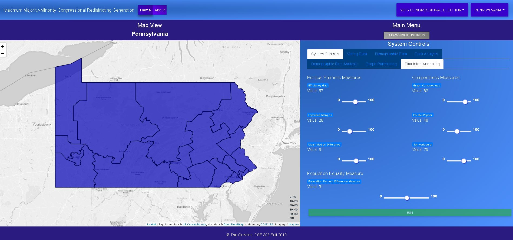

# Majority-Minority-Congressional-Redistricting-Generation
The system developed in this project allows for the generation of congressional district boundaries without political influence but with the maximum number of majority-minority districts. This system relates to, but is different from, systems developed in previous sections of CSE308. Those systems gathered data associated with this topic, analyzed the data using many of the proposed measures of Gerrymandering, presented the data in a way that highlighted the effects of gerrymandering, and explored various algorithms for automatic redistricting.

